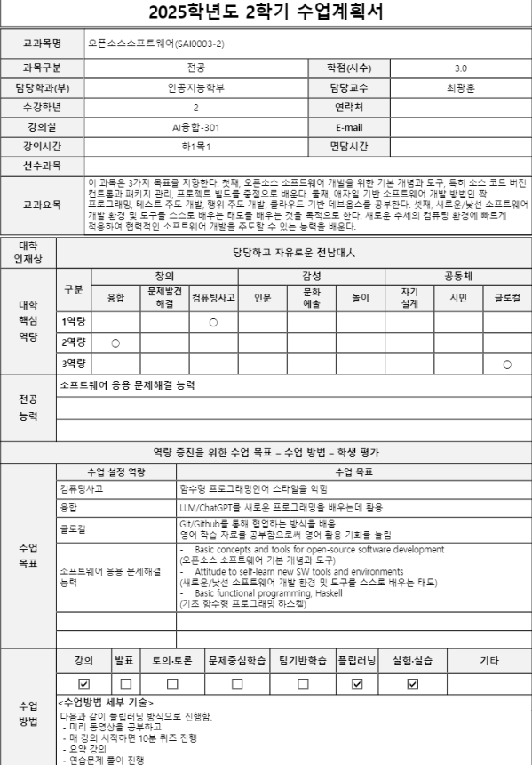

# 오픈소스소프트웨어 실습 과제

## Week1-1 강의 개요 (강의계획서)

> **오픈소스소프트웨어 수업**의 목적은 *협업 중심 개발 환경*을 이해하고  
> 오픈소스 생태계를 경험하는 것입니다.

- 수업 목표
- 평가 방법
- 실습 내용 요약

#### 

## Week1-2 오픈소스소프트웨어 개요

> 오픈소스소프트웨어(Open Source Software)는 *누구나 자유롭게 사용, 수정, 배포할 수 있는 소프트웨어*입니다.  
> 대표적인 오픈소스 예시는 **Linux**, **Python**, **Firefox**가 있습니다.

### 참고 링크

[오픈소스SW 포털](https://www.oss.kr)

---

## Week2-1 버전 관리 개요

> “버전 관리 시스템(VCS)”은 **파일의 변경 이력**을 기록하고,  
> 여러 사용자가 동시에 협업할 수 있도록 도와주는 도구입니다.

### 대표적인 버전 관리 시스템

1. **Centralized VCS** — SVN, CVS
2. **Distributed VCS** — Git, Mercurial

---

## Week2-2 Git

> Git은 *분산형 버전 관리 시스템*으로, 오프라인에서도 커밋과 브랜치 관리가 가능합니다.

## week2-3 Github, fork, pull request

> Github는 원격 저장소(Remote Repository) 서비스를 제공하여 개발자들이 협업할 수 있도록 돕는 플랫폼입니다.

### 핵심 개념 정리

- fork: 다른 사람의 저장소를 내 계정으로 복사
- pull request: 수정한 내용을 원래 저장소에 병합 요청
- clone: 원격 저장소를 내 컴퓨터에 복제

> GitHub 공식 문서
> [자세히 보기](https://docs.github.com/ko)

## week2-4 Git: Advancded Topics

> 고급 Git에서는 브랜치 관리, 병합(merge), 충돌(conflict) 해결을 배웁니다.

### 자주 사용하는 명령어

- 새 브랜치 만들기 : git branch feature/test
- 브랜치 전환하기 : git checkout feature/test
- 병합하기 : git merge feature/test

Conflict는 같은 파일의 같은 부분을 두 브랜치에서 다르게 수정했을 때 발생합니다.

## week3 Markdown

> Markdown은 간단한 문법으로 문서의 구조를 표현할 수 있는 경량 마크업 언어입니다.

### 주요 문법 요소

- Headers : #, ##, ###
- Emphasis : Italic, Bold
- Lists : - 또는 1.
- Blockquotes : >
- Links : [텍스트](URL)
- Images : 

> Markdown은 README, 블로그, 기술 문서 등에서 널리 사용됩니다.

---

이 README.md 파일은 Markdown 문법 실습을 위해 작성되었으며, Headers, Italic, Bold, Links Images, Lists, Blockquotes, Paragraphs를 모두 포함합니다. Git과 GitHub의 기본 사용법을 함께 복습하는 자료로도 활용됩니다.
